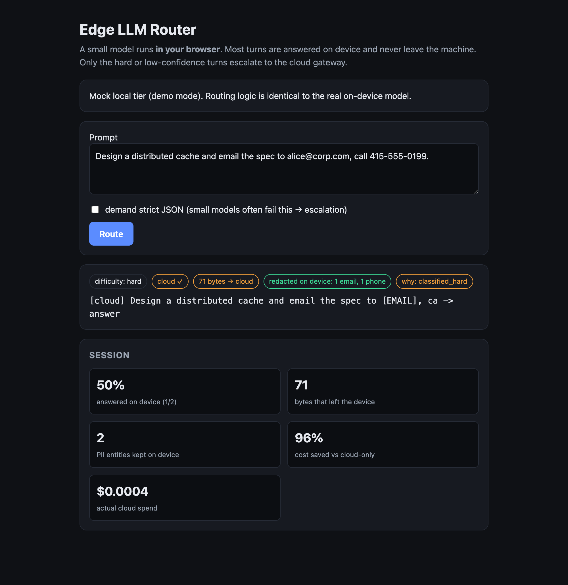
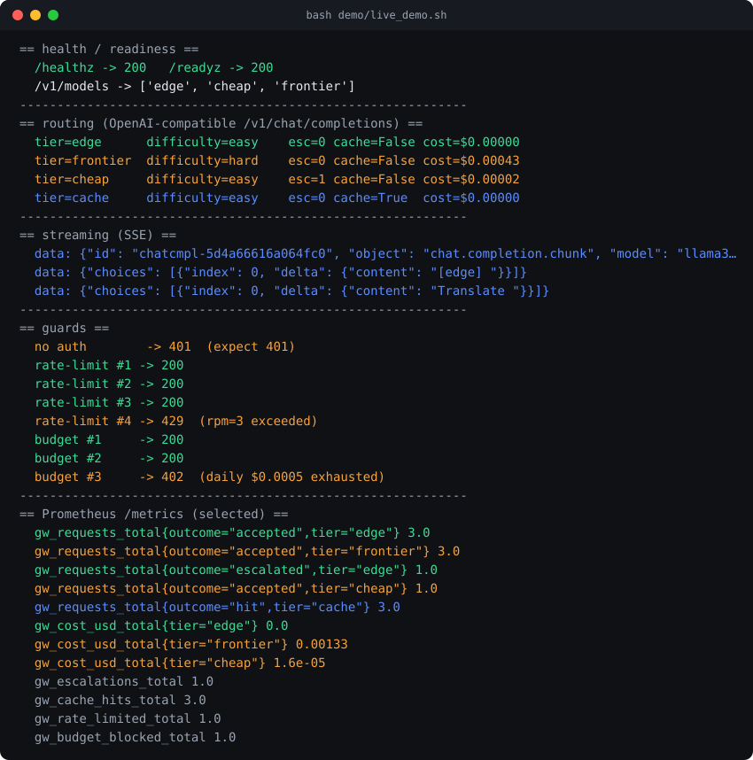

# llm-routing

LLM routing across the full **edge↔cloud spectrum**. The same idea — send each
request to the smallest place that can answer it well — in two runtimes that
compose into one system.

| Package | Where it runs | Stack | What it is |
|---|---|---|---|
| [`packages/gateway`](packages/gateway) | Server-side | Python, FastAPI, Redis, k8s | A production LLM gateway: classify → route across tiers → quality-gate → escalate, with per-provider circuit breakers, per-key budgets, an OpenAI-compatible API, and Prometheus metrics. |
| [`packages/edge-client`](packages/edge-client) | On-device (browser) | TypeScript, WebLLM, WebGPU | A router that runs a small model **in the browser**, answers most turns locally, and escalates only the hard ones to the gateway. |

The two halves are one system: the on-device router's escalation backend **is**
the gateway. Run both and the browser answers easy turns locally — nothing
leaves the device — and forwards the hard turns to the deployed gateway.

```
                         ┌─────────────────────── on device (edge-client) ──────────────────────┐
   user ─▶ browser ─▶ classify ─▶ local small model (WebLLM/WebGPU) ─▶ quality gate ─▶ keep local
                                                                              │ (hard / low-conf / invalid)
                                                                              ▼
   ┌───────────────────────────── cloud (gateway) ──────────────────────────────┐
   │ auth ─▶ rate-limit ─▶ budget ─▶ classify ─▶ route (small→cheap→frontier)    │
   │        ─▶ quality gate ─▶ escalate ; circuit breakers ; Redis ; /metrics    │
   └────────────────────────────────────────────────────────────────────────────┘
```

Both ends implement the same three pieces:

- **Routing decision** — classify difficulty, pick a tier.
- **Quality-aware fallback** — accept only if valid and confident, else escalate.
- **Eval** — measure the cost / privacy / quality tradeoff on real cases.

See [`docs/ARCHITECTURE.md`](docs/ARCHITECTURE.md) for the design and the
tradeoffs.

## Experiments (real models, no mock)

Six experiments on real inference — local models via Ollama, hosted APIs
(Anthropic, OpenAI, DeepSeek), and a self-hosted 72B on a rented A100 — each
scored by an independent `claude-opus-5` judge. Full writeups and charts in
[`docs/EXPERIMENTS.md`](docs/EXPERIMENTS.md); the honest headline of each:

1. **Cost-quality Pareto** — a gated router matches frontier quality at 59% lower cost, and the tier ladder turns out non-monotonic (a 2B scored below a 1B).
2. **Constrained decoding** — with a clear prompt, small models already emit 100% valid JSON; the real win is an 11x token collapse, not validity.
3. **Judge bias** — a model judging its own tier inflates it; a self-hosted judge is a lenient upper bound (edge 0.69 → 0.43 under an independent judge).
4. **Edge → cloud, 3 providers** — the router auto-selects the cloud by measured value, and an open model (DeepSeek) beat both proprietary frontiers on quality *and* cost.
5. **Predictive routing** — deciding from the query alone (route once) has a 9x-cheaper ceiling than cascade, but a naive predictor realizes only half of it; the predictor is the work.
6. **Serving a 72B** — vLLM continuous batching gives 12.1x throughput (vs 1.1x on Ollama), yet self-hosting still loses to a cheap hosted API until near-saturation.

One theme runs through them: a router, or a self-hosted GPU, is not automatically
cheaper. Strong-and-cheap hosted open models keep eroding the case, and the
experiments say so rather than hiding it.

## The edge client, in the browser

The on-device router escalates a hard prompt to the cloud, but strips PII on
device first, so the cloud only sees `[EMAIL]`. The panel tracks local share,
bytes off device, PII kept on device, and cost saved.



## The gateway, over HTTP

`bash packages/gateway/demo/live_demo.sh` boots a real uvicorn server and
exercises it end to end: tiered routing on the OpenAI-compatible endpoint, SSE
streaming, auth (401), rate limiting (429), budget caps (402), and a live
Prometheus scrape.



## Quickstart

```bash
# server-side gateway (Python) — runs offline on mock providers, no keys
cd packages/gateway
pip install -r requirements.lock
PYTHONPATH=src pytest -q                       # 13 tests
PYTHONPATH=src uvicorn gateway.app:app --port 8000

# on-device client (TypeScript) — routing core tests in Node, no browser
cd packages/edge-client
node --test                                    # 8 tests
node eval/run-eval.ts                           # local vs cloud vs router
npm install && npm run dev                      # browser app (WebGPU)
```

Or from the root:

```bash
make test     # both packages
make eval      # both evals
```

## Status

Both packages run and test offline with no API keys and no GPU. The gateway
deploys to Cloud Run or k8s (`packages/gateway/deploy`); the edge client runs a
real model in Chrome/Edge 113+ and degrades gracefully elsewhere. CI runs both
suites, the gateway Docker build, and the edge typecheck on every push.
