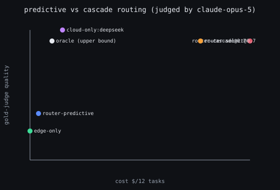
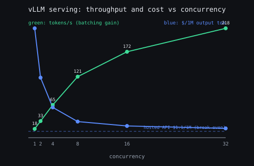
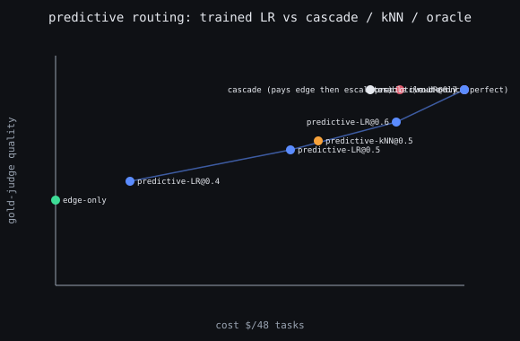

# Experiments: real local models

Everything below is real inference. Three models served by Ollama form the tier
ladder, a fourth acts as an LLM judge, and the numbers come from running the
`benchmarks/tasks.jsonl` set through each tier. No mock providers, no API keys,
no synthetic scores.

```bash
ollama serve
cd packages/gateway && python benchmarks/run_bench.py
```

Hardware: Apple M5, 32 GB. Reproduce with `benchmarks/run_bench.py`; raw
per-task numbers are in `benchmarks/results.json`.

## Setup

| Tier | Model | Size | Equivalent hosted price |
|---|---|---|---|
| edge | `llama3.2:1b` | 1.3 GB | $0.0001 / 1K tok |
| mid | `gemma4:e2b` | 7.2 GB | $0.0006 / 1K tok |
| frontier | `qwen2.5-coder:14b` | 9.0 GB | $0.01 / 1K tok |

The judge is `qwen2.5-coder:14b`, scoring each answer 0 to 1 for correctness and
relevance. Schema tasks are graded on strict JSON validity instead of the judge.
The task set is 12 prompts: 4 easy, 3 medium, 3 hard, 2 strict-JSON extractions.
Cost is the equivalent hosted spend, so local free inference still has a
meaningful cost axis to route against.

## Per-tier results


| Tier | Judge quality | Avg latency | Avg tokens |
|---|---|---|---|
| edge (1b) | 0.69 | 2.7 s | 153 |
| mid (2b) | 0.42 | 6.8 s | 251 |
| frontier (14b) | 0.90 | 9.3 s | 160 |

> These quality numbers are self-scored by the frontier model and run high.
> Experiment 3 measures the bias and Experiment 4 re-runs under an independent
> judge (edge falls to 0.43, frontier to 0.79). The ordering here holds; the
> levels are optimistic. Read the absolute numbers as a lenient upper bound.

## Finding 1: the ladder is not monotonic

The mid tier scores **below** the smaller edge tier on this set, 0.42 against
0.69. Two real causes show up in the raw numbers: the 2B model is the most
verbose of the three at 251 tokens per answer, and on several medium tasks it
padded a wrong or off-topic answer that the strict judge scored near zero, while
the 1B model gave a short correct one.

The lesson holds beyond these two models: a tier ladder has to be measured, not
assumed. Dropping a model in between two others because it is nominally bigger
is not guaranteed to buy quality, and here it buys latency and tokens for a
quality loss. A router that trusts model size as a proxy for capability would
route straight into the weakest tier.

## Finding 2: the router matches frontier quality at a fraction of the cost

Walking the ladder small to large and stopping at the first answer that clears a
confidence bar, swept across thresholds:


| Strategy | Quality | Cost $/req | Avg latency |
|---|---|---|---|
| edge-only | 0.69 | 0.00018 | 2.7 s |
| frontier-only | 0.90 | 0.01925 | 9.3 s |
| router @0.5 | 0.78 | 0.00141 | 4.4 s |
| **router @0.6** | **0.90** | **0.00784** | 9.2 s |
| router @0.9 | 0.90 | 0.01103 | 11.4 s |

At threshold 0.6 the router **matches frontier quality (0.90) at 59% lower
cost**. Its tier mix is 7 edge, 2 mid, 3 frontier: two thirds of the traffic
never touches the expensive model, and the hard third that does is exactly the
third the frontier is needed for.

## Finding 3: escalation trades latency for cost, not against it

The router is not a latency win here, and the honest chart shows it. Because a
miss on a cheap tier is discovered only after that tier answers, escalation runs
tiers in sequence and their latencies add up. Router @0.6 sits near frontier
latency while paying far less. The gate is a cost and quality instrument; when
latency is the priority the same confidence dial should be lowered so fewer
requests pay the sequential penalty, or the tiers should run speculatively in
parallel.

## Finding 4: strict JSON is a real failure mode, including on the frontier

On the two extraction tasks, the edge model produced invalid or wrong-shaped
JSON on both. The frontier model passed one and still failed the other by
renaming a required field. This is not a small-model quirk; it is why the gate
treats schema validity as a first-class accept condition and why
`CONSTRAINED_DECODING` exists. A model that is smart enough to extract the values
can still emit a structure the caller cannot parse, and only decoding-level
constraints remove that failure mode rather than hoping the model complies.

## Experiment 2: constrained decoding on real small models

`benchmarks/run_constrained_bench.py` runs 10 strict-JSON extraction tasks on the
two cheap tiers twice: once free-form, once with the decoder constrained to the
task's JSON Schema through Ollama's OpenAI-compatible `response_format`, the
local-tier analogue of Outlines or XGrammar. Both conditions ask for JSON in the
prompt, so the only variable is the decoder constraint. Validity is strict: parse
must succeed, every required key present, every value the right type.

The first pass looked like a landslide for constraints, 0% free-form to 40%. It
was an artifact. At a 200-token cap the verbose free-form answers were truncated
mid-object and scored invalid. That is a token-budget confound, not a structure
failure, so the budget was raised to 400 and the run repeated. The honest result:


| Tier | Free-form valid | Constrained valid | Avg tokens free | Avg tokens constrained |
|---|---|---|---|---|
| edge (1b) | 100% | 100% | 27 | 23 |
| mid (2b) | 100% | 100% | 266 | 24 |

Two findings, neither the one the naive run suggested.

**Validity is not where constraint pays off here.** Given a clear instruction and
enough tokens, both the 1B and the 2B model already emit strict-valid JSON on
every task. Constrained decoding removes zero validity-caused escalations on this
set. Instruction following, not decoding, carried simple single-object
extraction.

**Output discipline is where it pays off.** The 2B model free-form averages 266
completion tokens per answer, wrapping every result in markdown fences and a
preamble, against 24 constrained: **11x fewer tokens for the same valid JSON**.
The 1B model is already terse, 27 to 23. That verbosity is a real failure mode,
not a cosmetic one: it is exactly what truncated the first run under a normal
token cap and turned valid content into invalid output. Constrained decoding
makes small-model structured output compact, deterministic, and truncation-proof,
which is a cost, latency, and reliability win at once.

The honest caveat: these schemas are shallow. Constraint's validity benefit grows
with nested objects, enums, and arrays, and with weaker instruction following. On
flat two-field extractions a good prompt is enough for validity, and the win is
the 11x token collapse.

## Experiment 3: is the judge biased toward its own tier?

Experiment 1 used `qwen2.5-coder:14b` as both the frontier tier and the judge. A
model scoring its own outputs is a known bias, so it needs checking rather than
assuming. `benchmarks/run_judge_ab.py` re-scores the same answers with an
independent gold judge, `claude-opus-5`, and compares the two judges tier by
tier. Requires an `ANTHROPIC_API_KEY` in `packages/gateway/.env`.


| Tier | qwen (self-judge) | Opus 5 (independent) | inflation |
|---|---|---|---|
| edge (1b) | 0.87 | 0.58 | +0.29 |
| mid (2b) | 0.35 | 0.34 | +0.01 |
| frontier (14b) | 0.96 | 0.85 | +0.11 |

Overall the local judge scores **0.14 higher** than the independent one, and the
two judges correlate at **r = 0.86**.

**The ordering holds; the absolute numbers were optimistic.** An r of 0.86 means
the two judges rank answers the same way, so Experiment 1's *shape* stands: the
tier ladder and the router's cost-quality frontier don't move. What moves is the
level. Every tier's quality in Experiment 1 was inflated by a lenient judge.

**Self-preference is real but not the main bias.** The naive worry is that qwen
flatters its own frontier outputs, and it does, by +0.11. But that is the
*second* largest distortion. The largest is leniency toward the **weakest** tier:
qwen overrates the 1B edge model by +0.29, most of it on the hard tasks, where it
scored a garbled irrationality proof 0.90 that the gold judge scored 0.05. The
mid tier shows almost no gap because it mostly failed outright and both judges
agree on a failure. So the honest correction is not "discount the frontier" but
"the cheap tier is worse than a self-hosted judge reports," which **widens** the
real edge-to-frontier gap (0.58 vs 0.85) and makes the case for escalating hard
turns stronger, not weaker.

The methodological takeaway: a local judge is fine for *relative* routing
decisions, since it preserves order, but absolute quality claims need an
independent judge. A self-hosted eval loop should treat its own scores as a
lenient upper bound.

## Experiment 4: real edge-to-cloud escalation across three providers

Experiments 1-3 are all local. This one adds the boundary the whole repo is
about: local small models that escalate to **real hosted frontiers**.
`benchmarks/run_hosted_bench.py` runs a five-tier ladder across three cloud
providers and judges everything with the independent `claude-opus-5` gold judge
(so these numbers carry Experiment 3's correction, not the self-judge leniency).

| Tier | Model | Provider | Gold quality | Cost / 12 tasks |
|---|---|---|---|---|
| edge | `llama3.2:1b` | Ollama (local) | 0.51 | $0.0002 |
| local-frontier | `qwen2.5-coder:14b` | Ollama (local) | 0.77 | $0.018 |
| cloud:deepseek | `deepseek-chat` (open weight) | DeepSeek | **0.90** | **$0.0026** |
| cloud:sonnet | `claude-sonnet-5` | Anthropic | 0.84 | $0.042 |
| cloud:gpt5 | `gpt-5` | OpenAI | 0.75 | $0.076 |

Local prices are equivalent-hosted estimates; cloud prices are real published
rates (input/output priced separately). The judge is never a tier, so there is
no self-scoring bias.


**The gold judge confirms Experiment 1 was optimistic.** Under the independent
judge the local tiers drop: edge from 0.69 to 0.51, local-frontier (the same qwen
model) from 0.90 to 0.77. Experiment 1's ordering held, but its absolute quality
was inflated by the self-judge. Trust this table over Experiment 1's.

**The router auto-selects the cloud, and that is the whole point.** Nothing is
pinned to one cloud model. The router walks a cost-ordered chain and the quality
gate picks whichever tier first clears the bar; at the cloud step it chooses
across providers on its own. At threshold 0.9 it kept 8 of 12 tasks on local
models and escalated only the 4 hardest, and the gate picked the cloud, not a
human. It picked `deepseek` every time — see below.

**The open-weight model won on both axes.** `deepseek-chat`, served through a
cheap OpenAI-compatible API, scored 0.90 — higher than `claude-sonnet-5` (0.84)
and `gpt-5` (0.75) — at $0.0026, roughly 16x cheaper than sonnet and 29x cheaper
than gpt-5. `gpt-5` also hit its own trap: on one hard task it spent its entire
reasoning-token budget and returned empty, scoring 0 at the run's highest
single-call cost ($0.02). The best-value-cloud selector chose deepseek
unanimously, which is exactly the provider-agnostic behavior you want.

**Cascade still loses to selecting one cloud.** Walking every cloud in series
double-pays on hard turns; routing to the single best-value cloud is cheaper at
equal quality:

| Strategy | Quality | Cost / 12 |
|---|---|---|
| router-cascade @0.9 (walk every cloud) | 0.88 | $0.049 |
| router-select @0.9 (route to best-value cloud) | 0.89 | $0.017 |

**But the deeper finding: when the best cloud is cheap, the router barely helps.**
`cloud-only:deepseek` scores 0.90 at $0.0026 — *cheaper and higher quality* than
`router-select @0.9` (0.89 at $0.017), because the router still pays the local
tiers first before escalating. The economic case for a router assumes a large
cost gap between the cheap and the capable tier. A strong-and-cheap open model
collapses that gap and erodes the cost argument. The router's remaining value is
then on the axes this cost benchmark does not show: **privacy** (keep data on
device), **latency floor**, **offline operation**, and **not knowing in advance
which provider is best** — which is what the predictive router below addresses.

## Experiment 5: predictive routing (decide from the query, route once)

Every router above is a **cascade**: try a tier, gate, escalate. That is why it
double-pays. The alternative the field converged on (RouteLLM, aurelio
semantic-router) is **predictive**: look at the query, predict the tier that will
clear the bar, and go straight there — one call, no speculation.
`benchmarks/run_predictive_bench.py` measures it. It reuses Experiment 4's
gold-judge matrix (no models re-run) and adds only local embeddings. The
predictor is a cosine k-NN over prompt embeddings (`nomic-embed-text` via Ollama),
the same nearest-example mechanism as semantic-router. With only 12 tasks,
accuracy is estimated by leave-one-out cross-validation.



| Strategy | Quality | Cost / 12 | Note |
|---|---|---|---|
| router-cascade @0.7 | 0.86 | $0.017 | walks tiers |
| router-select @0.7 | 0.86 | $0.013 | routes to one cloud |
| **oracle (perfect prediction)** | **0.86** | **$0.0018** | route-once ceiling |
| router-predictive (k-NN, LOOCV) | 0.58 | $0.0008 | 50% accuracy |

**The predictive ceiling dominates — and the predictor is the whole game.** A
perfect predictor routes each task once (easy to free edge, hard to cheap
deepseek) and matches cascade quality (0.86) at **9x less cost** ($0.0018 vs
$0.017), because it never pays for a tier it does not use. That is the case for
predictive routing in one number.

But the realized predictor gets there only halfway. The k-NN predictor scored 50%
routing accuracy and under-routed 4 of 12 hard tasks to the edge model, dragging
quality to 0.58. The gap from 0.58 to the oracle's 0.86 *is* the predictor-quality
gap — nothing else. This is precisely why RouteLLM trains its router on 80k
preference battles rather than a handful of examples: predictive routing shifts
all the difficulty into the predictor, and a cosine k-NN over 12 prompts is not a
good enough predictor. The architecture is right; it demands a real, trained
classifier and real training data to pay off.

## Experiment 6: self-hosting a 72B — the serving economics

Every experiment so far *calls* models. This one *serves* one, to measure what a
hosted API hides: continuous-batching throughput and true cost-per-token. It runs
`Qwen2.5-72B-Instruct-AWQ` (a frontier-class open model, too big for the laptop)
on a rented **A100 80GB at $1.19/hr** via vLLM, and hits it with
`serving/bench_serving.py` across a concurrency sweep. The GPU $/hr is real; the
break-even target is DeepSeek's ~$1.10 / 1M output tokens.



| Concurrency | tokens/s | batching gain | $/1M output |
|---|---|---|---|
| 1 | 18 | 1.0x | $18.34 |
| 4 | 65 | 3.6x | $5.07 |
| 8 | 121 | 6.7x | $2.72 |
| 16 | 172 | 9.5x | $1.93 |
| 32 | 218 | **12.1x** | $1.52 |

**Continuous batching is the whole reason to run vLLM.** Throughput climbs from 18
tokens/s at one request to 218 at 32 concurrent — a **12.1x gain** on the same
GPU. Compare Experiment 2's dry-run against local Ollama, which gained 1.1x:
Ollama serves one stream at a time, vLLM packs the batch. Cost per token tracks
inversely: $18/1M idle, $1.52/1M full.

**But self-hosting a 72B still loses to the hosted API here.** Even at 32
concurrent — 12x batched — self-hosted output costs $1.52/1M, still above
DeepSeek's ~$1.10. Extrapolating the curve, break-even sits near ~300 tokens/s,
roughly concurrency 48+, i.e. you must keep the A100 near saturation around the
clock to match a pay-per-use API. This lands the same lesson as Experiments 4-5
from the serving side: a strong-and-cheap hosted open model (DeepSeek) is priced
so aggressively that self-hosting the equivalent only wins at sustained high
utilization. For most workloads, calling the API is cheaper than owning the GPU.

The honest caveats: TTFT (451 ms) includes network round-trip over RunPod's proxy,
not just the GPU; and `--max-model-len 4096` with a single A100 caps the batch, so
throughput would keep rising with more memory or a second GPU, pushing break-even
lower. The direction of the conclusion is robust; the exact crossover is
workload- and hardware-specific, which is exactly why the harness is parameterized.

## Experiment 7: a real predictor, and the confidence dial

Experiment 5 said predictive routing's ceiling dominates cascade but a naive
k-NN over 12 tasks realized only half of it. This does it properly.
`benchmarks/run_predictor.py` takes 48 varied prompts, labels each by whether the
edge tier (`llama3.2:1b`) clears the gold judge (`edge_ok`), and trains a real
classifier over prompt embeddings to predict `edge_ok` from the query alone — the
RouteLLM idea in miniature: predict whether the cheap tier wins, route once.
Evaluated out-of-fold, with a **confidence-abstain** knob: keep a query on edge
only if the predictor is at least `threshold` sure, else escalate.



A methodology note worth keeping: the first run scored the predictor *below
chance* (10%). The task set is ordered easy→hard, and unshuffled k-fold put an
entire class in the test fold that the model never trained on. Shuffling the
folds and reducing 768-dim embeddings to 16 via PCA (more features than samples
otherwise) fixed it.

**A trained predictor is much better than the naive one — but still not enough to
beat cascade here.** Out-of-fold accuracy: **LR 69%, k-NN 77%**, against a 54%
majority baseline and Experiment 5's ~50% — a real jump. The confidence dial
traces a genuine cost-quality curve:

| Strategy | Quality | Cost / 48 | routed to edge |
|---|---|---|---|
| edge-only | 0.62 | $0.0009 | 48 |
| cloud-only (deepseek) | 0.91 | $0.0084 | 0 |
| cascade (pays edge, then escalates) | 0.91 | $0.0072 | 26 |
| **oracle (route-once, perfect)** | **0.91** | **$0.0067** | 26 |
| predictive-LR @0.5 | 0.75 | $0.0052 | 33 |
| predictive-LR @0.6 | 0.83 | $0.0071 | 15 |

Two honest reads. First, the **oracle still dominates cascade** — 0.91 quality at
$0.0067 vs $0.0072 — because route-once never double-pays; the ceiling from
Experiment 5 holds on real data. Second, the **realized predictor does not reach
it**: at 69-77% accuracy, every misrouted hard query sent to edge costs quality
that cascade's *live* gate never loses (cascade runs the cheap tier, checks it,
and escalates only on an actual miss). Predictive trades that quality for cost
along the curve; it dominates cascade only where the tier cost gap is large enough
that avoiding the double-pay outweighs the misroute risk.

Here the gap is small — edge is ~free and the escalation target is cheap deepseek,
so cascade's double-pay is only ~8%, and its quality safety-net is worth it. That
is the same lesson as Experiments 4-6 once more: cheap, strong tiers shrink the
gap that makes clever routing pay. Predictive routing is the right architecture,
its ceiling wins, and closing the gap to that ceiling is a predictor problem —
which is exactly why RouteLLM trains on 80k battles, not 48 prompts.

## What this validates

- SLM-first with an escalation gate reproduces on real models: most traffic
  stays cheap and the expensive tier is spent only where it changes the answer.
- The confidence threshold is the one dial; sweeping it traces the cost-quality
  frontier directly.
- Capability is not size. The ladder must be validated per workload, and the
  judge must be independent — a self-hosted judge reports a lenient upper bound
  (Experiment 3), and it re-ranked the whole ladder once corrected (Experiment 4).
- The router is provider-agnostic and self-selecting: given several clouds it
  picks the best-value one through the gate, no human and no hardcoding.
- A router's cost win is conditional, not automatic. Cascade double-pays; select
  one cloud instead. And when a strong open model is also cheap (deepseek here),
  the cheap/capable cost gap collapses and the router's cost case with it — its
  value moves to privacy, latency, and offline operation.
- Predictive routing beats cascade in principle (the oracle route-once ceiling is
  9x cheaper at equal quality) but only as far as the predictor is good; a naive
  k-NN realizes half of it. The predictor, and its training data, is the work.
