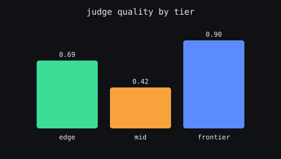
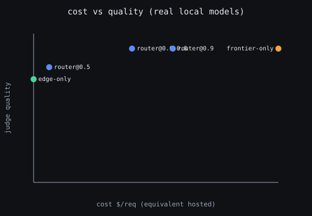
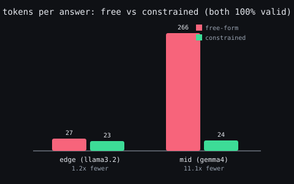

# Experiments: real local models

Everything below is real inference. Three models served by Ollama form the tier
ladder, a fourth acts as an LLM judge, and the numbers come from running the
`benchmarks/tasks.jsonl` set through each tier. No mock providers, no API keys,
no synthetic scores.

```bash
ollama serve
cd packages/gateway && python benchmarks/run_bench.py
```

Hardware: Apple M5, 32 GB. Reproduce with `benchmarks/run_bench.py`; raw
per-task numbers are in `benchmarks/results.json`.

## Setup

| Tier | Model | Size | Equivalent hosted price |
|---|---|---|---|
| edge | `llama3.2:1b` | 1.3 GB | $0.0001 / 1K tok |
| mid | `gemma4:e2b` | 7.2 GB | $0.0006 / 1K tok |
| frontier | `qwen2.5-coder:14b` | 9.0 GB | $0.01 / 1K tok |

The judge is `qwen2.5-coder:14b`, scoring each answer 0 to 1 for correctness and
relevance. Schema tasks are graded on strict JSON validity instead of the judge.
The task set is 12 prompts: 4 easy, 3 medium, 3 hard, 2 strict-JSON extractions.
Cost is the equivalent hosted spend, so local free inference still has a
meaningful cost axis to route against.

## Per-tier results



| Tier | Judge quality | Avg latency | Avg tokens |
|---|---|---|---|
| edge (1b) | 0.69 | 2.7 s | 153 |
| mid (2b) | 0.42 | 6.8 s | 251 |
| frontier (14b) | 0.90 | 9.3 s | 160 |

## Finding 1: the ladder is not monotonic

The mid tier scores **below** the smaller edge tier on this set, 0.42 against
0.69. Two real causes show up in the raw numbers: the 2B model is the most
verbose of the three at 251 tokens per answer, and on several medium tasks it
padded a wrong or off-topic answer that the strict judge scored near zero, while
the 1B model gave a short correct one.

The lesson holds beyond these two models: a tier ladder has to be measured, not
assumed. Dropping a model in between two others because it is nominally bigger
is not guaranteed to buy quality, and here it buys latency and tokens for a
quality loss. A router that trusts model size as a proxy for capability would
route straight into the weakest tier.

## Finding 2: the router matches frontier quality at a fraction of the cost

Walking the ladder small to large and stopping at the first answer that clears a
confidence bar, swept across thresholds:



| Strategy | Quality | Cost $/req | Avg latency |
|---|---|---|---|
| edge-only | 0.69 | 0.00018 | 2.7 s |
| frontier-only | 0.90 | 0.01925 | 9.3 s |
| router @0.5 | 0.78 | 0.00141 | 4.4 s |
| **router @0.6** | **0.90** | **0.00784** | 9.2 s |
| router @0.9 | 0.90 | 0.01103 | 11.4 s |

At threshold 0.6 the router **matches frontier quality (0.90) at 59% lower
cost**. Its tier mix is 7 edge, 2 mid, 3 frontier: two thirds of the traffic
never touches the expensive model, and the hard third that does is exactly the
third the frontier is needed for.

## Finding 3: escalation trades latency for cost, not against it

The router is not a latency win here, and the honest chart shows it. Because a
miss on a cheap tier is discovered only after that tier answers, escalation runs
tiers in sequence and their latencies add up. Router @0.6 sits near frontier
latency while paying far less. The gate is a cost and quality instrument; when
latency is the priority the same confidence dial should be lowered so fewer
requests pay the sequential penalty, or the tiers should run speculatively in
parallel.

## Finding 4: strict JSON is a real failure mode, including on the frontier

On the two extraction tasks, the edge model produced invalid or wrong-shaped
JSON on both. The frontier model passed one and still failed the other by
renaming a required field. This is not a small-model quirk; it is why the gate
treats schema validity as a first-class accept condition and why
`CONSTRAINED_DECODING` exists. A model that is smart enough to extract the values
can still emit a structure the caller cannot parse, and only decoding-level
constraints remove that failure mode rather than hoping the model complies.

## Experiment 2: constrained decoding on real small models

`benchmarks/run_constrained_bench.py` runs 10 strict-JSON extraction tasks on the
two cheap tiers twice: once free-form, once with the decoder constrained to the
task's JSON Schema through Ollama's OpenAI-compatible `response_format`, the
local-tier analogue of Outlines or XGrammar. Both conditions ask for JSON in the
prompt, so the only variable is the decoder constraint. Validity is strict: parse
must succeed, every required key present, every value the right type.

The first pass looked like a landslide for constraints, 0% free-form to 40%. It
was an artifact. At a 200-token cap the verbose free-form answers were truncated
mid-object and scored invalid. That is a token-budget confound, not a structure
failure, so the budget was raised to 400 and the run repeated. The honest result:



| Tier | Free-form valid | Constrained valid | Avg tokens free | Avg tokens constrained |
|---|---|---|---|---|
| edge (1b) | 100% | 100% | 27 | 23 |
| mid (2b) | 100% | 100% | 266 | 24 |

Two findings, neither the one the naive run suggested.

**Validity is not where constraint pays off here.** Given a clear instruction and
enough tokens, both the 1B and the 2B model already emit strict-valid JSON on
every task. Constrained decoding removes zero validity-caused escalations on this
set. Instruction following, not decoding, carried simple single-object
extraction.

**Output discipline is where it pays off.** The 2B model free-form averages 266
completion tokens per answer, wrapping every result in markdown fences and a
preamble, against 24 constrained: **11x fewer tokens for the same valid JSON**.
The 1B model is already terse, 27 to 23. That verbosity is a real failure mode,
not a cosmetic one: it is exactly what truncated the first run under a normal
token cap and turned valid content into invalid output. Constrained decoding
makes small-model structured output compact, deterministic, and truncation-proof,
which is a cost, latency, and reliability win at once.

The honest caveat: these schemas are shallow. Constraint's validity benefit grows
with nested objects, enums, and arrays, and with weaker instruction following. On
flat two-field extractions a good prompt is enough for validity, and the win is
the 11x token collapse.

## What this validates

- SLM-first with an escalation gate is not a story, it reproduces on real
  models: most traffic stays cheap and the expensive tier is spent only where it
  changes the answer.
- The confidence threshold is the one dial. Sweeping it traces the cost-quality
  frontier directly, and 0.6 is the knee for this workload.
- Capability is not size. The ladder must be validated per workload, which is
  what this harness is for.
