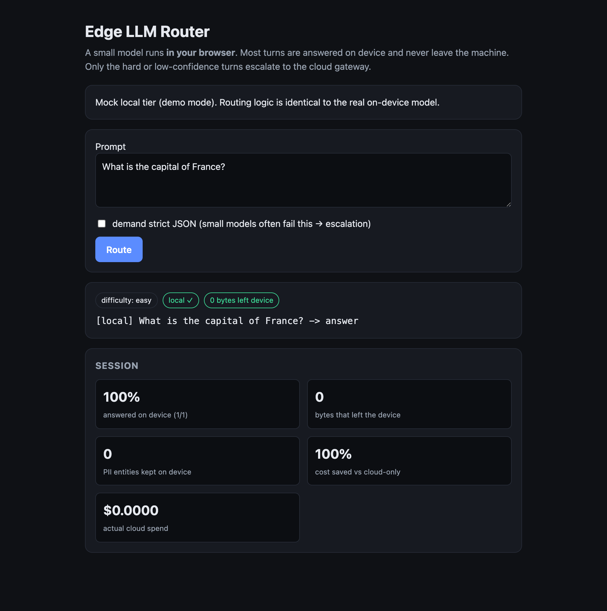

# edge-client — on-device (client-side) LLM router

Topology 2 of this monorepo: the router logic **and** a small model run in the
user's browser (WebLLM on WebGPU). Most turns are answered on device and never
leave the machine; only hard or low-confidence turns escalate to the cloud
gateway (`packages/gateway`).

```
prompt ─▶ classify (on device) ─▶ hard? ─▶ redact PII ─▶ cloud gateway
                                 └ else ─▶ local model ─▶ quality gate
                                                          ├ ok  ─▶ keep (0 bytes leave device)
                                                          └ bad ─▶ redact PII ─▶ cloud gateway
```

Privacy-preserving escalation: before any turn leaves the device it passes
through an on-device PII redactor (`src/core/redact.ts`, a JS-native, in-browser
counterpart to Microsoft Presidio), so emails, phones, SSNs, cards, and API keys
never reach the cloud even when the request does. The session panel counts PII
entities kept on device.

## Screenshots

A hard prompt carrying an email and phone escalates to the cloud, but the PII
is stripped on device first, so the cloud only sees `[EMAIL]`. The session panel
tracks local share, bytes off device, PII kept on device, and cost saved.


Easy prompts are answered on device and never leave the machine:



(Captured with `?engine=mock` for a deterministic demo; the real path runs a
WebLLM model on WebGPU.)

## Run it

```bash
npm install
npm run dev            # open the printed URL in Chrome/Edge 113+ (WebGPU)
```

First load downloads the quantized model weights once, then caches them in the
browser. No WebGPU (e.g. Safari < 26 / Firefox on some platforms) degrades to a
mock local tier so the routing still demos.

Point the cloud tier at your real gateway (from the browser console):

```js
localStorage.setItem("gatewayUrl", "https://llm-gateway-xxxx.run.app")
localStorage.setItem("gatewayToken", "dev-key")
```

## Verify without a browser

The routing brain is pure TypeScript, so it tests and evaluates in Node:

```bash
npm test               # node --test, pure-core unit tests
npm run eval           # local-only vs cloud-only vs router: privacy/cost/quality
npm run typecheck      # tsc --noEmit
```

Sample eval (mock engines, reproducible):

```
strategy      quality  toCloud  bytesOut      cost   avg_ms
local-only        64%     0/14         0  $0.00000       59
cloud-only       100%    14/14       756  $0.00411      631
router           100%     6/14       416  $0.00206      314
router vs cloud-only:  cost -50%,  bytes-off-device -45%
```

## Layout

```
src/core/       classifier · gate · router · metrics   (pure, tested in Node)
src/engines/    webllm (on-device) · cloud (gateway client) · mock (tests/fallback)
src/ui/         DOM app + styles
eval/           three-strategy comparison
test/           node --test
```

Security note: the browser never holds provider API keys. The cloud tier calls
YOUR gateway, which holds the keys and enforces auth/budgets. See
`../../docs/ARCHITECTURE.md`.
