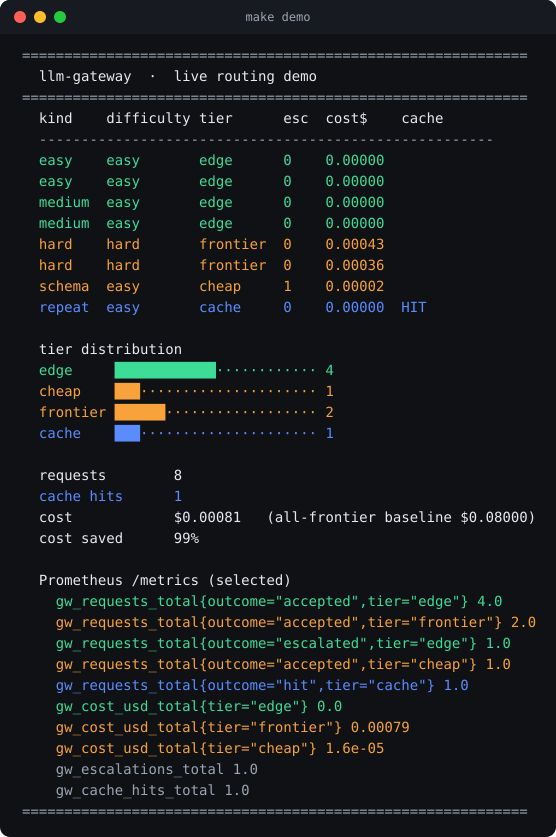

# gateway — server-side LLM router

A small, deployable **LLM router / gateway**. One endpoint takes a request,
decides how hard it is, tries the cheapest capable tier first, checks the
answer's quality, and escalates only when needed.

It runs offline on mock providers with **no API keys and no GPU**, then swaps
to real backends (Ollama on-device, plus any OpenAI-compatible API) by changing
env vars.

```
cache  ->  classify  ->  route (SLM-first)  ->  quality gate  ->  escalate
```

## Why this exists

The 2026 default should not be "call the frontier model for everything." It
should be "use the smallest model that clears the quality bar for this
request." That is a cost decision, a latency decision, and often a privacy
decision. This package is the reference implementation of that idea, with the
three pieces that make it more than a dumb proxy:

1. **AI routing decision.** A classifier estimates difficulty and picks the
   starting tier. Heuristic by default (`src/router/classifier.py`), or a
   trained softmax classifier over hashed features (`src/router/learned.py`)
   that adapts to your own traffic and exposes a calibrated confidence. Compare
   them with `python eval/run_router_eval.py`; swap in real embeddings to go
   further. Unlike RouteLLM's preference training, it is judged on downstream
   validity and cost, not preference.
2. **Quality-aware fallback.** A gate accepts a reply only if it validates
   (strict JSON when a schema is demanded) and clears a confidence bar.
   A low-confidence on-device answer, or a cheap model that botches strict
   JSON, is escalated. This is what turns error-fallback into quality
   fallback. See `src/router/gate.py`.
3. **Eval as a first-class output.** `eval/run_eval.py` pits the router
   against an always-frontier baseline and reports cost, latency, and
   quality/validity so you can prove the tradeoff on your own traffic.

## The small-model lane: SLM-first, escalate-on-fail

The EDGE tier is a small model served via Ollama. The pattern, from NVIDIA's
"Small Language Models are the Future of Agentic AI," is to run the small
model by default and escalate a single turn to a stronger model only when the
gate trips. Most routine work stays on the cheap lane.

A note on the word "edge": in **this** repo the small model runs *server-side*
next to the gateway, so "edge" means small and cheap, not literally on the
user's device. True on-device routing is a different topology where the router
and model run on the client; see `DESIGN.md` section 1a. `Tier.EDGE` keeps the
short name.

## Quickstart (offline, zero deps)

```bash
# route one prompt and see the whole decision trail
PYTHONPATH=src python -m router.cli "What is the capital of France?"

# a strict-JSON extraction: weak tiers fail the schema and escalate
PYTHONPATH=src python -m router.cli --schema service,root_cause \
  "Extract the failing service and root cause from this incident log"

# prove the tradeoff: router vs always-frontier
PYTHONPATH=src python eval/run_eval.py

# tests
PYTHONPATH=src python -m pytest -q
```

Sample eval output on the bundled 20 cases:

```
strategy             cost($)    avg_ms   quality
------------------------------------------------
baseline-frontier    0.00681     910.6      100%
router               0.00415     513.3      100%
------------------------------------------------
cost saved vs baseline: 39.0%
router tier mix       : {'edge': 10, 'cheap': 1, 'frontier': 9}
```

## Serve it

```bash
pip install fastapi uvicorn "pydantic>=2"
PYTHONPATH=src uvicorn router.server:app --reload
# POST /route {"prompt": "..."}   GET /healthz   GET /stats
```

Or with Docker:

```bash
docker build -t llm-router .
docker run -p 8000:8000 llm-router
```

## Go live

Copy `.env.example` to `.env` and point tiers at real backends:

- **EDGE via Ollama** (on-device): `EDGE_BACKEND=ollama`, `EDGE_MODEL=llama3.2:3b`,
  after `ollama serve` and `ollama pull llama3.2:3b`. Ollama speaks an
  OpenAI-compatible API, so local vs cloud is a config change, not a rewrite.
- **CHEAP / FRONTIER via any OpenAI-compatible API**: set `CHEAP_BACKEND=openai`,
  `FRONTIER_BACKEND=openai`, `OPENAI_BASE_URL`, `OPENAI_API_KEY`. Works with
  OpenAI, OpenRouter, vLLM, or a LiteLLM proxy.

## The one dial

`CONFIDENCE_THRESHOLD` is the cost/quality tradeoff in a single number.
Raise it and more requests escalate (safer, pricier). Lower it and more work
stays cheap (cheaper, riskier). Everything else is plumbing around this dial.

## Constrained decoding (opt-in)

Small models botch strict JSON, and that alone triggers escalation. Constrained
decoding removes that failure mode: tiers that control decoding (self-hosted via
grammar, in the spirit of Outlines / XGrammar) or expose `response_format`
(hosted APIs) are forced to emit schema-valid structure, so only genuinely hard
turns still escalate. Semantic quality still gates.

```bash
PYTHONPATH=src python eval/run_constrained_eval.py
```

```
constrained      escalated     cost($)
off                    5/6     0.00113
on                     0/6     0.00006
structure-caused escalations removed: 5   (cost on schema tasks: -94%)
```

Turn it on with `CONSTRAINED_DECODING=1` (or per request via `constrained` in
metadata). True grammar constraint needs raw logits, so it is a local/self-hosted
property; API tiers get the coarser `response_format` guarantee.

## Benchmark on real local models

`benchmarks/run_bench.py` runs the tier ladder as three real Ollama models
(`llama3.2:1b` → `gemma4:e2b` → `qwen2.5-coder:14b`), judges answers with the
strongest model, and plots the router against edge-only and frontier-only. No
mock providers, no keys.


At its knee the router **matches frontier quality (0.90) at 59% lower cost**,
keeping two thirds of traffic off the expensive model. The run also surfaces an
honest non-monotonic ladder (the 2B mid tier scores below the 1B edge on this
set) and strict-JSON failures that reach even the frontier.

`run_hosted_bench.py` extends this across the on-device/cloud boundary: local
models escalate to real hosted frontiers (`claude-sonnet-5`, `gpt-5`), the router
auto-selects the cloud provider through the quality gate, and everything is
scored by an independent `claude-opus-5` judge. It shows a real design trap —
speculatively trying two clouds in series costs more than calling one directly —
and the fix (route to a single selected cloud: -13% to -31% vs always-cloud at
equal quality). Full analysis, including the independent-judge correction to the
self-scored numbers above, in [`docs/EXPERIMENTS.md`](../../docs/EXPERIMENTS.md).

## Multi-cloud frontier: select, don't cascade

The frontier tier can be a **pool** of clouds instead of one model. Set
`FRONTIER_POOL_JSON` and escalation reaches the frontier once, then commits to a
**single** cloud — the best measured quality-per-dollar (`FRONTIER_SELECT=best_value`,
default) or the cheapest — rather than walking every cloud in series.

```bash
FRONTIER_POOL_JSON='[
  {"name":"deepseek","backend":"openai","model":"deepseek-chat","price_per_1k":0.0007,"competence":0.90},
  {"name":"sonnet","backend":"openai","model":"claude-sonnet-5","price_per_1k":0.006,"competence":0.85},
  {"name":"gpt5","backend":"openai","model":"gpt-5","price_per_1k":0.010,"competence":0.80}
]'
```

This is `docs/EXPERIMENTS.md` experiment 4 shipped: walking each cloud in turn
double-pays on every miss and loses to selecting one cloud up front, so the router
*routes to* the frontier, it does not *walk* it. Ordering is by measured effective
cost, not list price, since a reasoning model's real token bill only shows up after
the fact. Adding a provider is a config entry, not a code change.

## Layout

```
src/router/
  classifier.py   difficulty -> starting tier   (AI decision #1)
  gate.py         schema + confidence + optional LLM-judge  (AI decision #2)
  router.py       cache -> classify -> route -> gate -> escalate
  cache.py        checked before routing; exact or embedding
  providers/      mock (offline) | ollama (edge) | openai_like (cloud)
eval/             cases.jsonl + run_eval.py  (baseline vs router)
tests/            offline, no keys
```

See `DESIGN.md` for the architecture, the gateway-vs-router distinction, and
the tradeoffs behind the design.

---

## Production gateway (`src/gateway`)

The `router` core above runs the routing idea in a single synchronous process.
The `gateway` module is the production service built on the same core: async,
horizontally scalable, and OpenAI-compatible so existing clients point at it
unchanged.

What the gateway adds over the router core:

| Concern | router core | gateway |
|---|---|---|
| Concurrency | sync | async FastAPI + pooled `httpx.AsyncClient` |
| API | custom `/route` | OpenAI-compatible `/v1/chat/completions`, streaming SSE |
| State | in-memory | Redis (cache, breaker, rate-limit, budget) with in-memory fallback |
| Reliability | quality fallback only | per-provider circuit breaker + per-attempt timeouts |
| Cost governance | none | per-API-key rate limits and daily budget caps |
| Observability | none | Prometheus `/metrics`, structured JSON logs with request_id, OpenTelemetry tracing (`GW_OTEL_ENABLED=1`) with GenAI-style span attributes |
| Ops | none | `/healthz`, `/readyz`, graceful lifespan, Docker + k8s + CI |

Two escalation causes are kept distinct: the **circuit breaker** skips a
provider that is failing or timing out (reliability); the **quality gate**
escalates a weak-but-working answer (intelligence).

### Live demo

`make demo` (or `PYTHONPATH=src python demo/demo.py`) drives the gateway with a
scripted mix of requests and prints a routing + metrics dashboard, ending with a
live scrape of Prometheus `/metrics`:



Or exercise a real uvicorn server end to end over HTTP (routing, SSE streaming,
auth, rate limit, budget, metrics) with `bash demo/live_demo.sh`:


### Run it locally

```bash
pip install fastapi "uvicorn[standard]" "pydantic>=2" pydantic-settings prometheus-client httpx
PYTHONPATH=src uvicorn gateway.app:app --port 8000

curl -X POST localhost:8000/v1/chat/completions \
  -H "Authorization: Bearer dev-key" -H "Content-Type: application/json" \
  -d '{"messages":[{"role":"user","content":"What is the capital of France?"}]}'
```

Runs offline on mock providers with an in-memory store, no Redis needed. The
response carries an `x_gateway` block with the tier chosen, difficulty,
escalations, and cost.

### Full stack with Redis + Prometheus + Grafana

```bash
docker compose -f deploy/docker-compose.yml up --build
# gateway :8000   prometheus :9090   grafana :3000 (admin/admin)
```

### Kubernetes

```bash
kubectl apply -f deploy/k8s/     # Deployment (3 replicas, probes), Service, HPA
```

Endpoints: `POST /v1/chat/completions` (+`stream`), `GET /v1/models`,
`GET /healthz`, `GET /readyz`, `GET /metrics`.

Config is env-driven and validated at startup (`src/gateway/settings.py`,
prefix `GW_`). Point tiers at real backends with `GW_EDGE_BACKEND=ollama`,
`GW_CHEAP_BACKEND=openai`, `GW_FRONTIER_BACKEND=openai`, plus `GW_REDIS_URL`,
`OPENAI_BASE_URL`, `OPENAI_API_KEY`.
